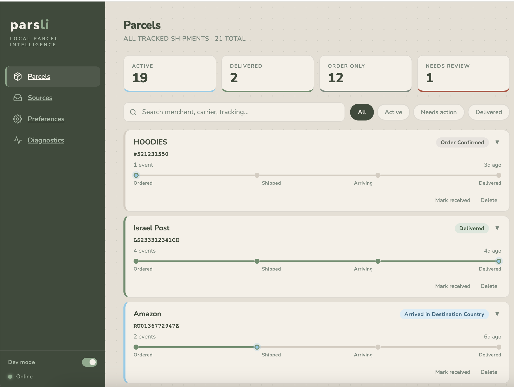

# Parsli — Local Parcel Intelligence

> A privacy-first parcel tracker that lives entirely on your laptop. Parsli reads
> shipping emails from your Gmail, extracts shipment status with a local Gemma
> model, and shows you a single "cargo manifest" of everything currently in
> flight — without sending a byte to the cloud.

**Built as a submission to the [Gemma 4 Challenge](https://dev.to/challenges/google-2025-12).**
Parsli uses `google/gemma-4-e4b` (the 4B-effective edge model) running in LM
Studio on the user's machine to do all classification and structured
extraction. No remote API calls, no third-party tracking services, no
analytics — your inbox stays yours.



<video src="docs/demo.mp4" controls width="100%">
  <source src="docs/demo.mp4" type="video/mp4" />
  <source src="docs/demo.mov" type="video/quicktime" />
  Your browser can't display inline video — <a href="docs/demo.mov">download the demo</a>.
</video>

---

## Why local-first?

Most parcel trackers ask for your inbox login or scrape it server-side. That
gives a vendor permanent visibility into every order you place, every store
you shop at, every package you receive. Parsli's design rule is the opposite:

- **Your data never leaves the device.** Every step — Gmail OAuth, email
  ingestion, classification, status extraction, dashboard rendering — runs on
  your machine.
- **No raw email bodies, HTML, or PII land in the DB.** We persist message
  IDs, sender domain, a body hash, the extracted structured fields, and short
  evidence snippets. That's it.
- **Local model.** A Gemma 4 model runs in LM Studio on the same laptop.
  No requests to OpenAI, Anthropic, or Google Cloud at inference time.
- **Tokens you control.** OAuth tokens are stored encrypted-at-rest by Google's
  client libraries inside a Docker volume on your machine. You can delete them
  any time from the Sources screen.

## Why Gemma 4?

The 4B effective-parameter model (`google/gemma-4-e4b`) is the sweet spot for
this workload:

- **Edge-class footprint** — fits in 8–10GB of RAM, runs at usable latency on
  M-series Macs with no GPU pinning.
- **Structured-output capable** — LM Studio's JSON-schema mode plus Gemma 4's
  improved instruction-following lets us get reliable typed extractions
  (`email_type`, `status`, `tracking_numbers`, `merchant`) without brittle
  string parsing.
- **Cheap enough to gate** — Parsli only calls the model when deterministic
  rules can't classify an email on their own. Most marketing noise gets
  filtered at the query level; obvious shipping emails are classified by
  regex; only the ambiguous middle goes to Gemma. That keeps the per-email
  cost low and the user's machine cool.

For deployments where you'd want bigger context or sharper reasoning (legal
docs, multi-page invoices) the same backend can be pointed at Gemma 4's 31B
dense model or 26B MoE — same OpenAI-compatible interface, just slower.

---

## Architecture

```
┌─────────────────────────────────────────────────────────────────────┐
│  Your Mac                                                           │
│                                                                     │
│   ┌──────────────┐    OAuth     ┌──────────────────────┐            │
│   │  Browser     │◀────────────▶│  Google (one-time)   │            │
│   │  localhost:  │              │  consent flow only   │            │
│   │   5173       │              └──────────────────────┘            │
│   └──────┬───────┘                                                  │
│          │ HTTP                                                     │
│          ▼                                                          │
│   ┌──────────────────┐      Docker network      ┌──────────────┐    │
│   │  frontend        │ ───────/api/*──────────▶ │  backend     │    │
│   │  (nginx + Vite   │                          │  FastAPI +   │    │
│   │   built SPA)     │                          │  SQLAlchemy  │    │
│   └──────────────────┘                          └──────┬───────┘    │
│                                                        │            │
│                                       ┌────────────────┼─────────┐  │
│                                       │ host.docker.internal:1234│  │
│                                       ▼                          │  │
│                                ┌───────────────┐  ┌───────────┐  │  │
│                                │  LM Studio    │  │  Gmail    │  │  │
│                                │  (host app)   │  │  API      │  │  │
│                                │  gemma-4-e4b  │  │  HTTPS    │  │  │
│                                └───────────────┘  └───────────┘  │  │
│                                                                  │  │
│                              ┌───────────────────────────────────┘  │
│                              ▼                                      │
│                       ┌────────────────────────┐                    │
│                       │  Host bind-mount       │                    │
│                       │  ./backend/.parsli/    │                    │
│                       │   ├─ credentials.json  │                    │
│                       │   ├─ tokens/*.json     │                    │
│                       │   └─ parsli.db         │                    │
│                       └────────────────────────┘                    │
└─────────────────────────────────────────────────────────────────────┘
```

### Pipeline

```
Gmail API → ingestor → cleaner → rule engine → model classifier → reconciler → resolution → projection
            │           │           │              │                  │             │             │
            │           │           │              │                  │             │             └─ dashboard projection
            │           │           │              │                  │             └─ canonical shipments + timelines
            │           │           │              │                  └─ rule vs model agreement, decision source
            │           │           │              └─ Gemma 4 via LM Studio (only for ambiguous rows)
            │           │           └─ deterministic regex + language packs (EN + HE)
            │           └─ HTML strip, boilerplate removal, footer stripping
            └─ stores only IDs, sender domain, hashes, extracted fields
```

The deterministic rule engine handles the bulk of emails. The model is invoked
in two modes:

- **`MODEL_REQUIRED`** — rules can't classify or the confidence is low. The full
  email preview is sent; the model returns the typed extraction.
- **`MODEL_AUDIT`** — rules are confident; the model gets a tiny preview and
  is asked only to agree/disagree. ~10x cheaper than `REQUIRED`.

Decision provenance (`RULE` / `MODEL` / `RULE_MODEL_AGREE` / `MODEL_OVERRIDE` /
…) is stored on every email_extractions row so the Diagnostics screen can
show you exactly which path made each classification.

### Tech stack

| Layer | Choice |
|---|---|
| Model | `google/gemma-4-e4b` running in LM Studio (host desktop app) |
| Backend | Python 3.12 · FastAPI · Pydantic v2 · SQLAlchemy 2.x · SQLite |
| Frontend | React 18 · Vite · TypeScript · TanStack Query · React Router |
| Email source | Gmail API via google-api-python-client |
| Packaging | Docker Compose (backend + frontend); LM Studio on host |
| Persistence | `backend/.parsli/` bind-mounted from host — credentials, tokens, SQLite all live there |

---

## Quick start (macOS)

### Prerequisites

- **Docker Desktop for Mac** ([download](https://www.docker.com/products/docker-desktop/))
- **LM Studio** ([lmstudio.ai](https://lmstudio.ai)) — the desktop app
- A **Google account** you control — Parsli reads from this account
- A **Google Cloud project** for OAuth credentials (free; no billing required)

### 1. Start the local model

1. Open LM Studio → search for **`google/gemma-4-e4b`** → download.
2. Open the *Local Server* tab.
3. Load the model and click **Start Server** (default port `1234`).
4. Verify: `curl http://localhost:1234/v1/models` should list the model.

> The backend reaches LM Studio through `host.docker.internal:1234` from
> inside its container; Docker Desktop adds this hostname automatically.

### 2. Set up Google Cloud OAuth credentials

This is the only step where you leave your machine. You're registering a
"test" OAuth client; nothing about Parsli ever leaves your laptop after this.

1. Go to [Google Cloud Console](https://console.cloud.google.com/).
2. Create a project (or pick an existing one).
3. **APIs & Services → Library** → search **Gmail API** → **Enable**.
4. **APIs & Services → OAuth consent screen**:
   - User type: **External**
   - App name: `Parsli (local)`
   - User support email: your address
   - Scopes: add `.../auth/gmail.readonly`
   - **Test users**: add every Google account you want Parsli to read.
     Without this, Google will reject the OAuth flow with `access_denied`
     because the app isn't verified.
5. **APIs & Services → Credentials → Create Credentials → OAuth client ID**:
   - Application type: **Web application**
   - Name: `Parsli local`
   - **Authorized redirect URI**: `http://localhost:8000/api/auth/callback`
6. Download the resulting JSON; rename it to `credentials.json`.

> **Production note.** "Test users" caps you at 100 manually-added emails
> and the consent screen shows a "this app is unverified" warning. For a
> real distribution you'd register the app through Google's verification
> process. For a local-first tool that runs entirely on the user's machine,
> test-mode is the right scope.

### 3. Plant the credentials on the host

The backend reads its app state from `backend/.parsli/` on your host, mounted
into the container at `/data`. Drop `credentials.json` straight there:

```bash
# Clone and enter the repo
git clone https://github.com/<you>/parsli.git
cd parsli

# Create the directory and drop in the OAuth client secret
mkdir -p backend/.parsli/tokens
cp ~/Downloads/credentials.json backend/.parsli/credentials.json
chmod 600 backend/.parsli/credentials.json
```

After OAuth, per-account refresh tokens land in `backend/.parsli/tokens/`
and the SQLite database lives at `backend/.parsli/parsli.db` — all on the
host, editable and inspectable with regular tools.

> **Want the data elsewhere?** Set `PARSLI_DATA_DIR=/absolute/path/to/dir`
> in `.env` and that directory is mounted as `/data` instead.

### 4. (Optional) Override defaults

```bash
cp .env.example .env
# Edit .env if you want a different model, lookback window, or endpoint.
```

Useful overrides:

| Variable | Default | What it changes |
|---|---|---|
| `PARSLI_MODEL__MODEL_NAME` | `google/gemma-4-e4b` | Which model name the backend sends to LM Studio. |
| `PARSLI_MODEL__ENDPOINT_URL` | `http://host.docker.internal:1234` | LM Studio server URL. |
| `PARSLI_DATA_DIR` | `./backend/.parsli` | Host directory mounted as `/data` inside the container. |
| `PARSLI_GMAIL__LOOKBACK_DAYS` | `60` | First-sync lookback window. |

### 5. Run it

```bash
docker compose up --build
```

| URL | What |
|---|---|
| http://localhost:5173 | Dashboard (open this) |
| http://localhost:8000/api/status | Backend health probe |
| http://localhost:8000/docs | Auto-generated OpenAPI docs |

Open the dashboard → **Sources** → **+ Add account**. The OAuth flow opens
in a new tab, you grant Parsli read-only access to your inbox, Google
redirects back to `localhost:8000/api/auth/callback`, and the token lands
in `backend/.parsli/tokens/`.

Click **Run initial sync** to pull the last 60 days of email. With Gemma 4
running in LM Studio on a 16GB M-series Mac, a fresh sync of a hundred
parcels' worth of emails takes a few minutes.

### 6. Stop / wipe / restart

```bash
docker compose stop                  # pause everything
docker compose down                  # remove containers (your backend/.parsli/ stays put)
rm backend/.parsli/parsli.db         # wipe just the DB
rm -rf backend/.parsli               # full wipe — credentials, tokens, DB
docker compose up --build            # rebuild after code changes
```

---

## Notebook playground

For poking at the pipeline interactively — re-running classification on a
single email, inspecting model outputs, comparing rule vs model decisions
— there's a Jupyter notebook at
[`notebooks/backend_playground.ipynb`](notebooks/backend_playground.ipynb).
It imports the same modules the backend uses, mirrors the five pipeline
stages (Gmail auth → preprocessing → model classification → persistence →
projection), and caches downloaded emails to disk so you can iterate
without re-running the fetch step every time.

```bash
cd backend
pip install -e ".[notebook]"          # adds pandas + jupyter
cd ../notebooks
jupyter notebook backend_playground.ipynb
```

Handy for debugging a misclassified email or experimenting with prompt
changes before wiring them into the live pipeline.

---

## Observability

Everything Parsli classifies is observable from the dashboard's **Diagnostics**
screen (toggle *Dev mode* in the sidebar to reveal it):

- **Pipeline stage cards** — ingested vs processed vs relevant vs ignored.
- **Classification method breakdown** — what share of decisions came from
  rules, rule+model agreement, model override, etc. Per-method average
  latency is shown alongside.
- **Recent processing table** — the last 30 emails with email_id, result
  (relevant or ignored + reason), classification method, AI latency, and
  status. Anything flagged `needs_review` gets a ⚠ marker.
- **Recent query runs** — per-batch Gmail query timing, grouped by
  `fetch_batch_id`, so you can see exactly which canned query terms surfaced
  which emails.

Backend-side, all model calls are timed and the latency is persisted on
`email_extractions.model_latency_ms`. The decision provenance enum
(`RULE` / `MODEL` / `RULE_MODEL_AGREE` / `MODEL_OVERRIDE` / `RULE_OVERRIDE` /
`SEMANTIC_GUARD` / `REVIEW_NEEDED` / `MODEL_FALLBACK`) tells you, for any
event in the timeline, whether the deterministic rule or the model made the
call — and if both, whether they agreed.

### How we run the model

LM Studio runs on the host as the desktop app. Click *Local Server* → load
`google/gemma-4-e4b` → *Start Server* → port `1234`. The backend reaches
it from inside its container via `host.docker.internal:1234`, talking to
LM Studio's OpenAI-compatible `POST /v1/chat/completions` endpoint in
structured-output mode:

```python
{
  "model": "google/gemma-4-e4b",
  "messages": [{"role": "user", "content": <prompt>}],
  "response_format": {
    "type": "json_schema",
    "json_schema": {"name": "extraction", "schema": <pydantic schema>, "strict": true}
  },
  "temperature": 0.1
}
```

The response comes back as JSON that matches a Pydantic model
(`ModelClassificationResult` for full extraction, `ModelAuditResult` for
audit mode). The client keeps a single persistent `httpx.Client` so the OS
doesn't open a fresh TCP connection per email.

If LM Studio is unreachable or the model isn't loaded, the backend raises
`ModelUnavailableError`. The sync API maps that to **HTTP 503** with a
clear "model not loaded, load it and retry" message, instead of silently
falling back to rules-only and pretending the sync succeeded.

> **Why LM Studio on the host instead of containerised?** LM Studio is a
> desktop GUI app with no official headless Docker image. The backend code
> works against anything that speaks OpenAI's `/v1/chat/completions`
> (ollama, llama.cpp server, vLLM, …) — swap the
> `PARSLI_MODEL__ENDPOINT_URL` env var if you want to try a different
> serving stack.

---

## Future improvements

Parsli is a first cut shaped to fit this challenge's submission window.
The natural next steps:

### Smarter shipment merging — a graph instead of a list

Today a "shipment" is a canonical row keyed on a single identifier
(tracking number, or order number when no tracking is available yet).
Real life is messier:

- An order email from `next.co.il` and a delivery notification from
  `israelpost.co.il` are the *same parcel*, but they share no identifier.
- An Amazon order can fan out into multiple sub-shipments, each with its
  own tracking number.

The right data structure is a graph of `Order ←→ Shipment ←→ TrackingNumber`
with merge edges that can be added or removed by the user. The current
`shipment_aliases` table is a degenerate version of this; promoting it to
a proper bipartite graph with explicit merge evidence (sender domain
overlap, temporal proximity, identical merchant) would let us automatically
link Next's order email to Israel Post's delivery notification.

### Carrier-website tracking augmentation

When an email mentions a tracking number but no recent status update, fetch
the live status from the carrier's tracking site (Israel Post, USPS,
DHL, UPS, …). Either by:

- Their public tracking pages (HTML scraping; brittle but free).
- Their public APIs where available (USPS, UPS Developer API, DHL Unified
  Tracking — each has its own approval flow).

This would let Parsli show "left Berlin sort facility 14h ago" without
needing the carrier to email you about it.

### Per-order product extraction

Right now we know *that* there's a parcel and *where* it is — we don't know
*what's in it*. The order-confirmation emails almost always contain the
line items. Adding a `products: list[Product]` extraction step would let
the dashboard show "3× cotton crew socks" instead of just
"LX894521209HK". This is a perfect fit for Gemma 4's structured output:
hand the order-confirmation body to the model with a `Product[]` schema
and let it pull `name`, `qty`, `price`, `image_url`.

### Actions inside the dashboard

The card footers already have "Mark received" and "Delete" as local-only
actions. Natural extensions:

- **Reschedule** (for `action_required` / pickup events that link to a
  carrier portal) — open the right URL in a new tab.
- **Snooze / hide** for emails that aren't really parcels (e.g. digital
  product receipts the rules misclassified).
- **Bulk actions** — multi-select cards and act on them.

### Packaging for distribution

For a non-developer to use Parsli today they need Docker Desktop, LM Studio,
and a Google Cloud project. That's a lot. A real v1 ships as:

- A single `.dmg` for macOS that bundles the backend (pyoxidizer or
  py2app), the frontend (a packaged Electron or Tauri shell), and
  optionally an embedded `llama.cpp` server with a pre-quantised Gemma 4
  GGUF — so step 1 of the install is just "open the disk image".
- An auto-updater fed by GitHub Releases.
- A `--first-run` wizard that walks the user through the Google Cloud OAuth
  setup with deep links into the right Cloud Console screens.

### Security hardening

- **Token storage** — today tokens sit in a Docker volume as plain JSON
  files (the format google-auth-oauthlib writes). For a distributed
  binary, tokens should live in the macOS Keychain (and on Linux, in
  `libsecret`/GNOME Keyring) instead of on-disk.
- **Credentials.json** is an OAuth client secret. For a single-machine
  install that's acceptable; for a distributed binary every user should
  get their own OAuth client through the first-run wizard, not a shared
  secret embedded in the bundle.
- **Database encryption at rest** — wrap the SQLite file with SQLCipher
  so a stolen laptop disk doesn't leak the user's inbox metadata.
- **Sandboxing** — the model server (LM Studio or embedded llama.cpp)
  should run inside a sandbox that can't reach the network at all. The
  whole point of "local model" is moot if it phones home; explicit
  sandboxing makes that guarantee enforceable, not just trust-the-vendor.

### Beyond macOS, beyond Gmail

- **iOS / Android.** A mobile build using the same React/TypeScript core
  via Capacitor or React Native, with a quantised Gemma 4 4B running on
  the device's NPU (Core ML on iPhone, NNAPI/QNN on Android). This is
  exactly the form-factor Gemma 4's small models are built for.
- **Other inbox sources.** Outlook (Microsoft Graph), Yahoo, IMAP-only
  hosts. The ingestor is the only Gmail-specific piece; the cleaner,
  rule engine, model classifier, and resolution layer are mail-source
  agnostic.
- **Non-email sources.** SMS shipping notifications, screenshots of order
  confirmation pages, push notifications from carrier apps — Gemma 4's
  native multimodal capabilities make screenshots the most interesting
  expansion (point your phone at a paper delivery slip).

---

## Repository layout

```
.
├── docker-compose.yml          ← backend + frontend stack (LM Studio runs on host)
├── .env.example                ← override defaults (model name, lookback days, endpoint, data dir)
├── backend/                    ← FastAPI + Pydantic + SQLAlchemy
│   ├── Dockerfile
│   ├── pyproject.toml
│   ├── src/parsli/
│   ├── tests/                  ← pytest, 200+ tests
│   └── .parsli/                ← bind-mounted into container; credentials + tokens + SQLite
├── frontend/                   ← React + Vite + TS SPA
│   ├── Dockerfile              ← multi-stage: node build → nginx serve
│   ├── nginx.conf              ← SPA fallback + /api proxy
│   └── src/
│       ├── api/                ← typed client + DTO types
│       ├── components/         ← Sidebar, ParcelCard, atoms, …
│       └── screens/            ← Parcels, Sources, Preferences, Diagnostics
└── notebooks/                  ← Jupyter playground (Parts 1-5 of the pipeline)
```

---

## License

MIT — see [LICENSE](LICENSE).
